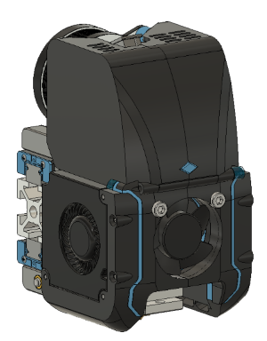
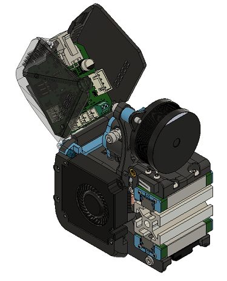
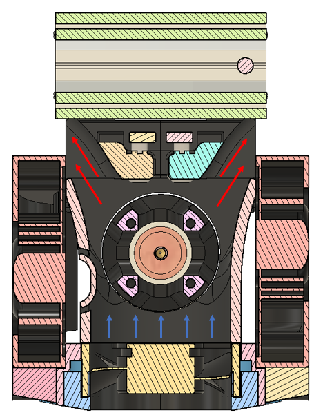
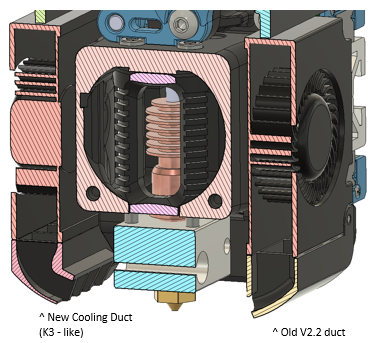
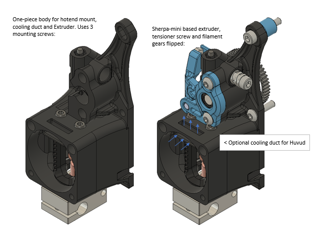

# Tronhead
A CoreXY Toolhead for Voron printers

The goal of this project was to create a compact solution integrating the many popular print head features that brought my printer to back to life (direct drive extruder, CAN board, and dockable magnetic z-probe) without giving up the part cooling capabilities of dual 4010 radial fans. This toolhead achieves that while maintaing a very small form factor and low weight (~285 grams for the complete assembly less the mgn9h carts). Some key features:

- Integrated Sherpa mini extruder (modified to sit lower and further back on a 30mm fan hotend)
- Integrated Huvud PCB, w/forward folding hinge for easy access. 
- Hotend/extruder mount is a single piece design, making for a very rigid interface with fewer screws. 
- Ducted hotend flow path with more open design for good airflow with 30mm axial fan.
  *Requires 3010 hotend fan and currently built around Dragon hotend. 
- Uses ANNEX Quickdraw dockable magnetic probe. 
- Higher flow part cooling ducts (Annex K3 inspired design) 

I've run it with single mgn9h rail (top), dual rail (front/bottom & top/bottom), and have settled on top/bottom dual mgn9h setup as that allowed tucking hotend as close to the x-rail as possible with the least amount of play in the mgn9h carts. I wanted to run with just a single mgn9h top rail configuration, but there was some play evident in that configuration.

HOTEND Fan Duct Flow Path:

PART Fan Duct Flow Path:

Sherpa-Mini modifications:

- tensioner screw flipped and passes through body now to save space and prevents heat-set insert from pulling out.
- filament gears flipped. Pushes whole assembly with motor back another 8mm so overhang is less over x-rail.
- merged into hotend mount so the interface is rigid and supports sherpa at front end.
 

# Things that are specific to my setup!
- XY joints: Belt sits 2mm closer to extrusion, need to print and install XY joints (in STL's folder) to maintain proper alignment if installing on Voron.
- My NEMA14 motor has a 10-tooth drive gear on the output shaft (LDO). 8t and 9t are now also common, but may not have enough adjustment range to mesh properly, I haven't checked.

# Basic BOM:
- 30mm x 10mm axial fan (x1)
- 4010 radial fans (x2)
- Dragon Style hotend
- LDO NEMA 14 motor (currently configured for 10t drive gear)
- BMG 3mm hobbed gears and associated shafts and bearings
- ANNEX Quickdraw Probe
- Huvud toolhead PCB (optional)
- misc m3 screws (m3x30mm is the largest)
- m3 heatset inserts (5.0mm x 4.0mm)(x6)

## Huvud Toolhead PCB
https://github.com/bondus/KlipperToolboard

## ANNEX Engineering Quickdraw Probe -
Toolhead uses this complete dockable probe solution from ANNEX:

https://github.com/Annex-Engineering/Quickdraw_Probe

## ANNEX Engineering Sherpa Mini Extruder
Extruder design based on this extruder from ANNEX:

https://github.com/Annex-Engineering/Sherpa_Mini-Extruder

You can find me on Discord with any other questions, u/moab1#9591
